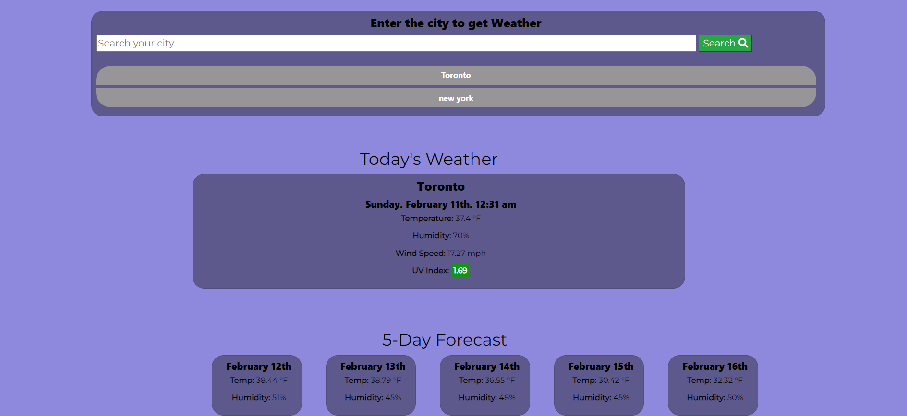
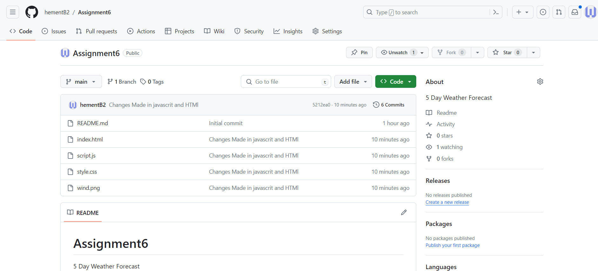

# Assignment6

## Overview
This weather application is built to provide users with current weather information and a 5-day forecast for any city. It utilizes the OpenWeatherMap API to fetch weather data and dynamically updates the user interface with the retrieved information. Users can search for a city, view its current weather conditions, and access a forecast for the upcoming days.

## Key Features
1. Search Functionality: Users can enter the name of a city to retrieve weather information.
2. Past City Searches: The application stores past city searches locally and provides buttons for users to quickly access previously searched cities.
3. Current Weather Display: The application displays current weather details such as temperature, humidity, and wind speed for the searched city.
4. 5-Day Forecast: Users can view a forecast for the next 5 days, including temperature and humidity.
5. UV Index Display: The application fetches UV index data for the searched city and displays it with color-coded indicators.
6. File Structure

## The application consists of two main files:

HTML File: Contains the structure and layout of the weather application interface.
JavaScript File: Handles the logic for fetching weather data from the API, updating the interface, and managing past city searches.
API Integration

# The application integrates with the OpenWeatherMap API to fetch weather data. It makes two API calls:

Current Weather API Call: Retrieves current weather data for the specified city.
5-Day Forecast API Call: Fetches a 5-day forecast for the specified city, including temperature and humidity data.
Functionality
Form Submission: Users can submit a city name through the form to retrieve weather information.
Local Storage: Past city searches are stored locally, allowing users to quickly access previously searched cities.
Dynamic Updates: The application dynamically updates the interface with weather information fetched from the API.
UV Index Display: UV index data is fetched and displayed with color-coded indicators based on severity.

# Dependencies
Moment.js: Used for date formatting and manipulation.
Bootstrap: Provides styling for the application layout.
Font Awesome: Supplies icons for buttons and other elements.

# Usage
Open the HTML file in a web browser.
Enter the name of a city in the search input and submit the form.
View the current weather information and 5-day forecast displayed on the interface.
Access past city searches using the provided buttons.
Future Improvements
Error handling for invalid city names or failed API requests.
Implementation of additional weather data, such as precipitation and atmospheric pressure.
Enhanced styling and user interface improvements for better usability.

# Github Repository- 

GITUB repository link- https://github.com/hementB2/Assignment6

Website Link- https://hementb2.github.io/Assignment6/

